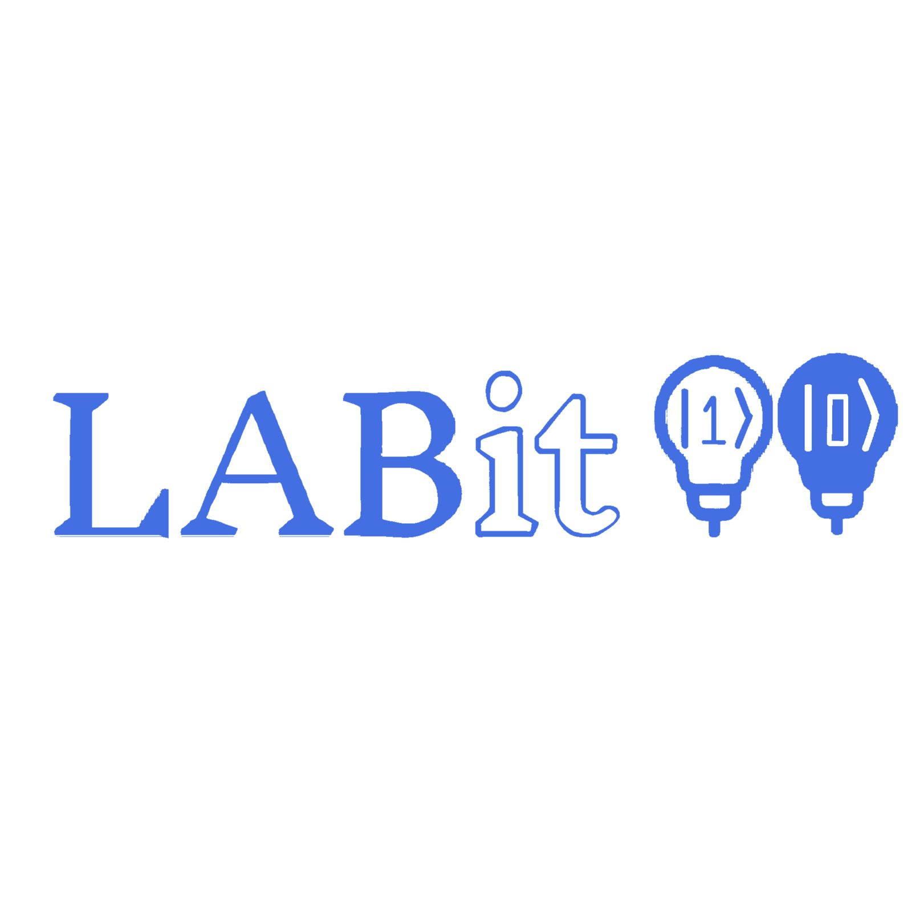

## Activity

  
  

## Repositories

  

    <a href="https://github.com/polysamo/Quantum_net">
      <picture>
        <source media="(prefers-color-scheme: dark)" srcset="https://github-readme-stats.vercel.app/api/pin/?username=polysamo&repo=Quantum_net&theme=dracula">
        <source media="(prefers-color-scheme: light)" srcset="https://github-readme-stats.vercel.app/api/pin/?username=polysamo&repo=Quantum_net&theme=dracula">
        
      </picture>
    </a>
    <a href="https://github.com/polysamo/LABIT">
      <picture>
        <source media="(prefers-color-scheme: dark)" srcset="https://github-readme-stats.vercel.app/api/pin/?username=polysamo&repo=LABIT&theme=dracula">
        <source media="(prefers-color-scheme: light)" srcset="https://github-readme-stats.vercel.app/api/pin/?username=polysamo&repo=LABIT&theme=dracula">
        
      </picture>
    </a>
  

## Social Media

  
  
  

  
